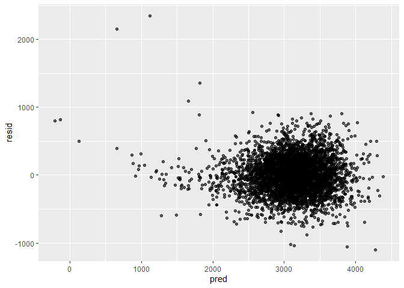
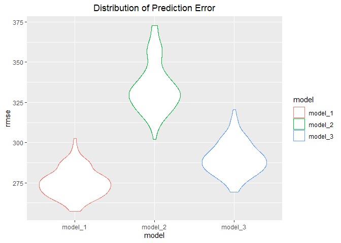

p8105\_hw6\_yk2960
================
Youyuan(Keviant) Kong
2021/12/3

## Problem 1

First, we get the data from the file, convert 5 variables to factor
variables: </br> babysex,frace,malfrom and mrace.</br> And there is no
missing data in this data frame. </br>

``` r
bw_df<-read.csv("data/birthweight.csv") %>% 
  janitor::clean_names() 
```

    ## Warning in FUN(X[[i]], ...): strings not representable in native encoding will
    ## be translated to UTF-8

    ## Warning in FUN(X[[i]], ...): unable to translate '<U+00C4>' to native encoding

    ## Warning in FUN(X[[i]], ...): unable to translate '<U+00D6>' to native encoding

    ## Warning in FUN(X[[i]], ...): unable to translate '<U+00E4>' to native encoding

    ## Warning in FUN(X[[i]], ...): unable to translate '<U+00F6>' to native encoding

    ## Warning in FUN(X[[i]], ...): unable to translate '<U+00DF>' to native encoding

    ## Warning in FUN(X[[i]], ...): unable to translate '<U+00C6>' to native encoding

    ## Warning in FUN(X[[i]], ...): unable to translate '<U+00E6>' to native encoding

    ## Warning in FUN(X[[i]], ...): unable to translate '<U+00D8>' to native encoding

    ## Warning in FUN(X[[i]], ...): unable to translate '<U+00F8>' to native encoding

    ## Warning in FUN(X[[i]], ...): unable to translate '<U+00C5>' to native encoding

    ## Warning in FUN(X[[i]], ...): unable to translate '<U+00E5>' to native encoding

``` r
bw_df<-bw_df %>% 
  mutate(babysex=factor(babysex,
                           levels = c(1,2),
                           labels = c("male","female")),
         frace=factor(frace,
                   levels = c(1,2,3,4,8,9),
                   labels = c("White","Black","Asian","Puerto.rican","Other","Unkown")),
         malform=factor(malform,
                     levels = c(0,1),
                     labels = c("absense","present")),
         mrace=factor(mrace,
               levels = c(1,2,3,4,8),
               labels = c("White","Black","Asian","Puerto.rican","Other")))


bw_df_clean <-bw_df %>% 
  drop_na()
```

About data-driven model-building process, I use LASSO to remove some
variables.

``` r
x = model.matrix(bwt ~ ., bw_df)[,-1]
y = bw_df$bwt
```

``` r
lambda = 10^(seq(3, -2, -0.1))

lasso_fit =
  glmnet(x, y, lambda = lambda)

lasso_cv =
  cv.glmnet(x, y, lambda = lambda)

lambda_opt = lasso_cv$lambda.min
```

``` r
selected_cols<-broom::tidy(lasso_fit) %>% 
  select(term, lambda, estimate) %>% 
  filter(lambda==lambda_opt,
         term!="(Intercept)") %>% 
  pull(term) 
```

``` r
x <- x %>% 
  data.frame() %>% 
  select(selected_cols) %>% 
  data.matrix()
```

    ## Note: Using an external vector in selections is ambiguous.
    ## i Use `all_of(selected_cols)` instead of `selected_cols` to silence this message.
    ## i See <https://tidyselect.r-lib.org/reference/faq-external-vector.html>.
    ## This message is displayed once per session.

``` r
y = bw_df$bwt


linear_model_1 = lm(y ~ x)
summary(linear_model_1)
```

    ## 
    ## Call:
    ## lm(formula = y ~ x)
    ## 
    ## Residuals:
    ##      Min       1Q   Median       3Q      Max 
    ## -1096.47  -185.16    -3.18   173.22  2343.40 
    ## 
    ## Coefficients:
    ##                      Estimate Std. Error t value Pr(>|t|)    
    ## (Intercept)        -6075.2970   140.2433 -43.320  < 2e-16 ***
    ## xbabysexfemale        28.6359     8.4588   3.385 0.000717 ***
    ## xbhead               130.7777     3.4475  37.934  < 2e-16 ***
    ## xblength              74.9448     2.0199  37.103  < 2e-16 ***
    ## xdelwt                 1.3856     0.2358   5.877 4.48e-09 ***
    ## xfincome               0.2869     0.1791   1.602 0.109205    
    ## xfracePuerto.rican   -52.2069    42.4273  -1.231 0.218576    
    ## xgaweeks              11.5416     1.4644   7.881 4.07e-15 ***
    ## xmenarche             -3.5476     2.8912  -1.227 0.219884    
    ## xmheight               6.8158     1.7992   3.788 0.000154 ***
    ## xmomage                0.7708     1.2199   0.632 0.527498    
    ## xmraceBlack         -137.5706    10.2139 -13.469  < 2e-16 ***
    ## xmraceAsian          -74.0356    42.7168  -1.733 0.083136 .  
    ## xmracePuerto.rican   -51.9029    43.2055  -1.201 0.229700    
    ## xparity               95.2984    40.4520   2.356 0.018525 *  
    ## xsmoken               -4.8597     0.5862  -8.290  < 2e-16 ***
    ## xwtgain                2.7202     0.4325   6.289 3.51e-10 ***
    ## ---
    ## Signif. codes:  0 '***' 0.001 '**' 0.01 '*' 0.05 '.' 0.1 ' ' 1
    ## 
    ## Residual standard error: 272.3 on 4325 degrees of freedom
    ## Multiple R-squared:  0.7183, Adjusted R-squared:  0.7173 
    ## F-statistic: 689.3 on 16 and 4325 DF,  p-value: < 2.2e-16

``` r
linear_model_1 %>% 
  broom::tidy() %>% 
  knitr::kable()
```

| term               |      estimate |   std.error |   statistic |   p.value |
|:-------------------|--------------:|------------:|------------:|----------:|
| (Intercept)        | -6075.2970250 | 140.2432586 | -43.3197081 | 0.0000000 |
| xbabysexfemale     |    28.6359352 |   8.4588080 |   3.3853393 | 0.0007172 |
| xbhead             |   130.7776777 |   3.4474819 |  37.9342611 | 0.0000000 |
| xblength           |    74.9447596 |   2.0199011 |  37.1031823 | 0.0000000 |
| xdelwt             |     1.3856234 |   0.2357509 |   5.8774889 | 0.0000000 |
| xfincome           |     0.2868896 |   0.1790701 |   1.6021074 | 0.1092049 |
| xfracePuerto.rican |   -52.2068609 |  42.4273176 |  -1.2305011 | 0.2185764 |
| xgaweeks           |    11.5416227 |   1.4644148 |   7.8813892 | 0.0000000 |
| xmenarche          |    -3.5475574 |   2.8912109 |  -1.2270144 | 0.2198840 |
| xmheight           |     6.8157568 |   1.7992092 |   3.7881959 | 0.0001538 |
| xmomage            |     0.7708189 |   1.2198794 |   0.6318812 | 0.5274979 |
| xmraceBlack        |  -137.5705609 |  10.2139423 | -13.4688993 | 0.0000000 |
| xmraceAsian        |   -74.0356317 |  42.7167938 |  -1.7331739 | 0.0831360 |
| xmracePuerto.rican |   -51.9028734 |  43.2055353 |  -1.2013015 | 0.2297001 |
| xparity            |    95.2984083 |  40.4519761 |   2.3558406 | 0.0185252 |
| xsmoken            |    -4.8597045 |   0.5862473 |  -8.2895132 | 0.0000000 |
| xwtgain            |     2.7201929 |   0.4325147 |   6.2892500 | 0.0000000 |

``` r
a<-summary(linear_model_1) %>% 
  broom::tidy() %>% 
  filter(p.value<=0.05) %>% 
  pull(term)
```

In these variable, p value which is less than 0.05 should be kept:</br>
(Intercept), xbabysexfemale, xbhead, xblength, xdelwt, xgaweeks,
xmheight, xmraceBlack, xparity, xsmoken, xwtgain

``` r
bw_df %>% 
  modelr::add_residuals(linear_model_1) %>% 
  modelr::add_predictions(linear_model_1) %>% 
  ggplot(aes(x = pred, y = resid)) +
  geom_point(alpha = 0.6)
```

<!-- -->

Although outlines exist when prediction is small, in the most of the
time the plot shows no heteroscedasticity and distribute around 0.

Compare your model to two others:

-   One using length at birth and gestational age as predictors (main
    effects only)
-   One using head circumference, length, sex, and all interactions
    (including the three-way interaction) between these

``` r
linear_model_2 <- lm(bwt ~ blength + gaweeks, data = bw_df)
linear_model_3 <-
  lm(bwt ~ bhead + blength + babysex + bhead*blength + bhead*babysex + blength*babysex + bhead*blength*babysex, data = bw_df)
summary(linear_model_2)
```

    ## 
    ## Call:
    ## lm(formula = bwt ~ blength + gaweeks, data = bw_df)
    ## 
    ## Residuals:
    ##     Min      1Q  Median      3Q     Max 
    ## -1709.6  -215.4   -11.4   208.2  4188.8 
    ## 
    ## Coefficients:
    ##              Estimate Std. Error t value Pr(>|t|)    
    ## (Intercept) -4347.667     97.958  -44.38   <2e-16 ***
    ## blength       128.556      1.990   64.60   <2e-16 ***
    ## gaweeks        27.047      1.718   15.74   <2e-16 ***
    ## ---
    ## Signif. codes:  0 '***' 0.001 '**' 0.01 '*' 0.05 '.' 0.1 ' ' 1
    ## 
    ## Residual standard error: 333.2 on 4339 degrees of freedom
    ## Multiple R-squared:  0.5769, Adjusted R-squared:  0.5767 
    ## F-statistic:  2958 on 2 and 4339 DF,  p-value: < 2.2e-16

``` r
summary(linear_model_3)
```

    ## 
    ## Call:
    ## lm(formula = bwt ~ bhead + blength + babysex + bhead * blength + 
    ##     bhead * babysex + blength * babysex + bhead * blength * babysex, 
    ##     data = bw_df)
    ## 
    ## Residuals:
    ##      Min       1Q   Median       3Q      Max 
    ## -1132.99  -190.42   -10.33   178.63  2617.96 
    ## 
    ## Coefficients:
    ##                               Estimate Std. Error t value Pr(>|t|)    
    ## (Intercept)                 -7176.8170  1264.8397  -5.674 1.49e-08 ***
    ## bhead                         181.7956    38.0542   4.777 1.84e-06 ***
    ## blength                       102.1269    26.2118   3.896 9.92e-05 ***
    ## babysexfemale                6374.8684  1677.7669   3.800 0.000147 ***
    ## bhead:blength                  -0.5536     0.7802  -0.710 0.478012    
    ## bhead:babysexfemale          -198.3932    51.0917  -3.883 0.000105 ***
    ## blength:babysexfemale        -123.7729    35.1185  -3.524 0.000429 ***
    ## bhead:blength:babysexfemale     3.8781     1.0566   3.670 0.000245 ***
    ## ---
    ## Signif. codes:  0 '***' 0.001 '**' 0.01 '*' 0.05 '.' 0.1 ' ' 1
    ## 
    ## Residual standard error: 287.7 on 4334 degrees of freedom
    ## Multiple R-squared:  0.6849, Adjusted R-squared:  0.6844 
    ## F-statistic:  1346 on 7 and 4334 DF,  p-value: < 2.2e-16

Make this comparison in terms of the cross-validated prediction error
and violin plot.

``` r
cv_df <-  
  crossv_mc(bw_df, 100) %>% 
  mutate(
    train = map(train, as_tibble),
    test = map(test, as_tibble)) %>% 
  mutate(
    linear_model_1 = map(train, 
                         ~lm(bwt ~ babysex+bhead+blength+delwt+
                                    fincome+frace+gaweeks+menarche+
                                    mheight+momage+mrace+mrace+
                                    mrace+smoken+wtgain, 
                         data = .x)),
    linear_model_2 = map(train, 
                         ~lm(bwt ~ blength + gaweeks, 
                         data = .x)),
    linear_model_3 = map(train, 
                         ~lm(bwt ~ bhead + blength + babysex + bhead*blength +                                   bhead*babysex + blength*babysex +
                             bhead*blength*babysex,
                         data = .x))) %>% 
  mutate(
    rmse_model_1 = map2_dbl(linear_model_1, test, ~rmse(model = .x, data = .y)),
    rmse_model_2 = map2_dbl(linear_model_2, test, ~rmse(model = .x, data = .y)),
    rmse_model_3 = map2_dbl(linear_model_3, test, ~rmse(model = .x, data = .y)))


cv_df %>% 
  select(starts_with("rmse")) %>% 
  pivot_longer(
    everything(),
    names_to = "model", 
    values_to = "rmse",
    names_prefix = "rmse_") %>% 
  mutate(model = fct_inorder(model)) %>% 
  ggplot(aes(x = model, y = rmse)) + 
  geom_violin(aes(color=model)) +
  scale_x_discrete(breaks = c("model_1","model_2","model_3"))+
  labs(title = "Distribution of Prediction Error")+
  theme(plot.title = element_text(hjust = 0.5))
```

<!-- -->

## Problem 2

``` r
weather_df = 
  rnoaa::meteo_pull_monitors(
    c("USW00094728"),
    var = c("PRCP", "TMIN", "TMAX"), 
    date_min = "2017-01-01",
    date_max = "2017-12-31") %>%
  mutate(
    name = recode(id, USW00094728 = "CentralPark_NY"),
    tmin = tmin / 10,
    tmax = tmax / 10) %>%
  select(name, id, everything())
```

    ## Registered S3 method overwritten by 'hoardr':
    ##   method           from
    ##   print.cache_info httr

    ## using cached file: C:\Users\KEVINK~1\AppData\Local/Cache/R/noaa_ghcnd/USW00094728.dly

    ## date created (size, mb): 2021-10-05 09:34:33 (7.617)

    ## file min/max dates: 1869-01-01 / 2021-10-31

We’ll focus on a simple linear regression with tmax as the response and
tmin as the predictor, and are interested in the distribution of two
quantities estimated from these data: *r*<sup>2</sup> and
*l**o**g*(*β*<sub>0</sub> \* *β*<sub>1</sub>)

``` r
linear_model = lm(tmax ~ tmin, data = weather_df)
# R2
R_2 = 
  linear_model %>% 
    broom::glance() %>% 
    pull(r.squared)
# log(β^0∗β^1)
linear_model_df = 
  linear_model %>% 
  broom::tidy()
beta0 = linear_model_df %>%  filter(term == '(Intercept)') %>%  pull(estimate)
beta1 = linear_model_df %>%  filter(term == 'tmin') %>%  pull(estimate)
logbeta = log(beta0 * beta1)
print(R_2)
```

    ## [1] 0.9115425

``` r
print(logbeta)
```

    ## [1] 2.013752

Use 5000 bootstrap samples and, for each bootstrap sample, produce
estimates of these two quantities.

``` r
weather_samples <- 
  weather_df %>% 
    modelr::bootstrap(n = 5000) %>% 
    mutate(
      models = map(strap, ~ lm(tmax ~ tmin, data = .x)),
      estimates = map(models, broom::tidy),
      glance = map(models, broom::glance))
weather_samples_info <- 
  weather_samples %>% 
    unnest(glance, estimates) %>% 
    select(.id, term, estimate, r.squared) %>% 
    # bracket can cause error
    mutate(term = ifelse(term == '(Intercept)', 'beta0', 'beta1')) 
```

    ## Warning: unnest() has a new interface. See ?unnest for details.
    ## Try `df %>% unnest(c(glance, estimates))`, with `mutate()` if needed

``` r
weather_samples_info <- weather_samples_info %>% 
    pivot_wider(names_from = term, 
                values_from = estimate) %>% 
    mutate(
      logbeta = log(beta0 * beta1)
    )
```

Using the 5000 bootstrap estimates, identify the 2.5% and 97.5%
quantiles to provide a 95% confidence interval

``` r
weather_samples_info %>% 
  summarize(
    r_low = quantile(r.squared,probs = c(0.025)),
    r_high = quantile(r.squared,probs = c(0.975))
  ) %>% 
  knitr::kable()
```

|    r\_low |   r\_high |
|----------:|----------:|
| 0.8941584 | 0.9265502 |

``` r
weather_samples_info %>% 
  summarize(
    logbeta_low = quantile(logbeta,probs = c(0.025)),
    logbeta_high = quantile(logbeta,probs = c(0.975))
  ) %>% 
  knitr::kable()
```

| logbeta\_low | logbeta\_high |
|-------------:|--------------:|
|     1.965926 |      2.057424 |
